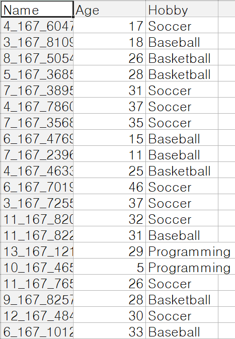
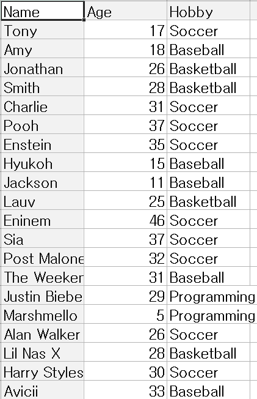

# data-anonymization
이 레포는 대한민국의 데이터 3법 중 익명화에 대한 부분을 실제 구현해본 코드를 포함합니다.

아래의 이미지는 [user_information](./data/user_information.csv) 이라는 csv 파일을 익명화하기 전과 후를 나타냅니다.

# Warning

⚠️ 해당 코드는 **공개 키 암호화**방식을 사용하였습니다. 개인이 구축한 방식이기 때문에 실제 보안에 매우 취약합니다. 연구와 구현을 목적으로 짠 코드이기 때문에 절대 보안용으로는 사용하지 마시기 바랍니다.

⚠️ This code uses **public key encryption** method. It's very vulnerable to real security because it's a privately built way. It is a code written for research and implementation purposes, so please do not use it for security purposes.

# License

© 2022, data-anonymization. Released under [GNU General Public License v3.0](https://www.gnu.org/licenses/gpl-3.0.html).

**data-anonymization** repository is authored and maintained by [@CharlesbrownK](https://github.com/CharlesbrownK).